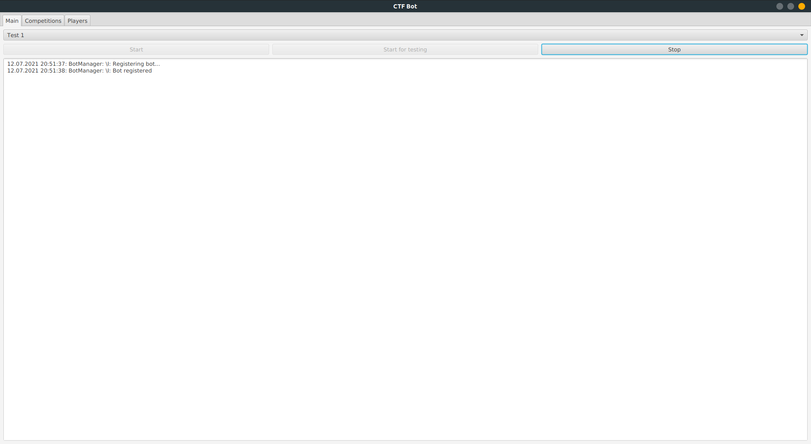
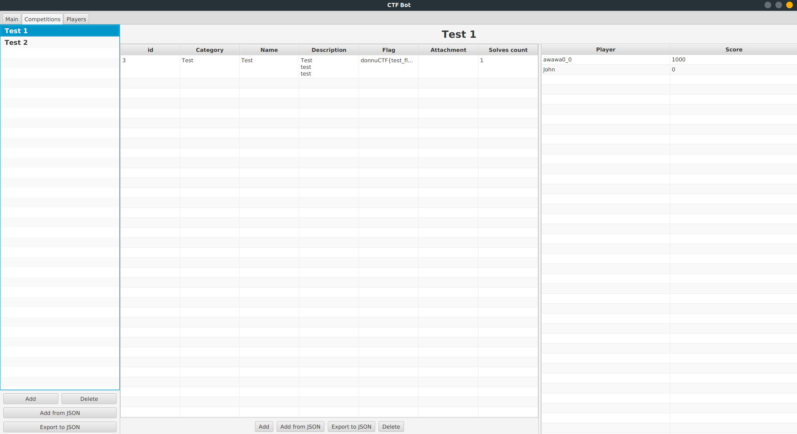
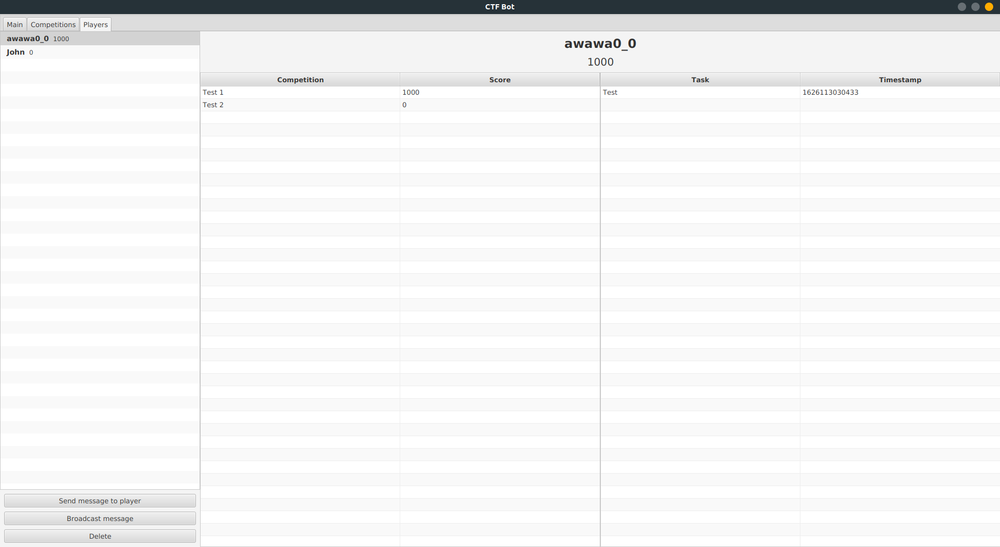

# CTF Bot

## Description
Telegram bot that is used to organize CTF trainings in Donetsk National University.

## Usage
0) Download the bot .jar file https://github.com/0awawa0/CTF_Bot/releases or build bot from sources.
1) If you have not registered your bot yet, read documentation [Telegram APIs](https://core.telegram.org/api) or contact @BotFather bot through Telegram to register your bot. After registering your bot you will get <i>your_bot_token</i> and <i>your_bot_name</i>. Put BotCredentials.json file to the folder where bot is placed filled as follows:
```json
{
    "token": "<i>your_bot_token</i>",
    "name": "<i>your_bot_name</i>"
}
```
    
2) Run the CTF_Bot.jar

You don't need your own web server to make your bot reachable on the internet. That means bot running on your local machine will be reachable from all over the world. That makes hosting CTF competitions and trainings easier than ever.


## Bot interface and features

The bot management program has one window with three views: main, competitions and players.

## Main view



Here you can pick the competition you want to start and either start it for public usage, or start bot in testing mode.
If you start bot in a testing mode, dialog will pop up requesting you to input the password required to use bot features.
Users will have to send this password to bot to be able to work with it.

There is also a button to stop bot. Note that stopping bot may take a while. Actually it is way much faster to just 
close the app and restart it, if you need.

At the bottom there is a log area.

## Competitions view



Competitions view allows you to manage your competitions.
Left pane contains list of all competitions in the database and buttons to add and delete currently selected competition.
Also, there is a buttons to import and export competitions from JSON file.

Right pane contains information about selected competition. There is a list of tasks and the scoreboard for the competition.
You can edit tasks right from the table. Just double-click on the field you want to change, enter new value and 
press "Enter" to commit changes to database. At the top of right pane there is a competition name. You can change it 
the same way you change tasks. At the bottom of right pane there are buttons similar to the ones on the left pane but 
for tasks.

### Importing from JSON

To import tasks and competitions from JSON file your JSON file must have specific format.

Task entity format:

```json
{
  "category": "Some category",
  "name":  "Some name",
  "flag": "Some flag",
  "description": "Some description",
  "attachment": "./attachment_file"
}
```

Fields `description` and `attachment` are optional. `attachment` field is supposed to be the path to the file you want 
to attach to the task. It does not matter if it is a relative or an absolute path, although you probably want to put 
files in the same directory with bot, or in some of its subdirectories. In the example above bot will look for the file
named `attachment_file` in the same directory it is placed.

Competition entity format:

```json
{
  "name": "Some name",
  "tasks": [
    {
      "category": "Some category",
      "name": "Some name",
      "flag": "Some flag"
    },
    ...
  ]
}
```

So the competition entity has only one required field - `name`. Field `tasks` is optional. It is an array of task 
entities described above.

When you import competitions or tasks, you must format your json to be an array of entities you are importing, even if 
there is only one entity you want to import. Otherwise, you will just get an error. So to import a single competition 
you need to format your json as follows:

```json
[
  {
    "name": "Some name"
  }
]
```

Same for task:

```json
[
  {
    "category": "Some category",
    "name": "Some name",
    "flag": "Some flag"
  }
]
```

Obviously, if you want to import more than one entity at a time, you just add more of them into the array:

```json
[
  {
    "name": "Some name"
  },
  {
    "name": "Another name",
    "tasks": [
      {
        "category": "Some category",
        "name": "Some name",
        "flag": "Some flag"
      },
      {
        "category": "Another category",
        "name": "Another name",
        "flag": "Another flag"
      }
    ]
  }
]
```

Exporting feature will export entities to json formatted as an array, so it is guaranteed that you can export task 
to the json file and import it from this file. Although exporting feature does not support exporting more than one 
entity at a time for now. Exporting the competition will, of course, export all of its tasks,
but you can only export one competition at a time.

## Players view



Players view contains information about players. Left pane is a scoreboard, every time you open the view players will 
be sorted by their total score (total score is a score among all the competitions in the database). You can delete 
players, but you cannot change either player's name, nor its score. Right pane contains information about currently 
selected player. Here you can see its total score, its score for every competition in the database and list of tasks 
player solved for selected competition (will show all solutions if the competition is not selected).

Also, here you can send message to the selected player, or to all the players in the database. After you click on 
"Send message to player" or "Broadcast message" dialog window will open with text area to enter the message and buttons
"Send" and "Cancel".

# Dynamic scoring

As you might have noticed, bot does not support setting tasks prices. That's because bot uses dynamic scoring feature - 
the more players solve the task, the less task's price is. Moreover, bot doesn't even store players' scores, it just 
calculates them when required. To calculate task price CTFd dynamic scoring formula is used 
(https://github.com/CTFd/DynamicValueChallenge):


Bot uses following values:

```
a = 1000
b = 100
s = 10
```

So this means, that the first player who solves the task will gain 1000 points, every following solution will raise 
fewer points until after 10 solves the task price will stay at 100.

Note that although first player gets 1000 points for the solution, these points will decrease with other solutions. 
So all players solved same task will have exact same amount of points for this task no matter when they solved it.

Example:

```
John solves some task and gains 1000 points. Next solution will cost less - 991 points.
Next, Bob solves the same task and gains 991 points. Now, the scoreboard will NOT look like this:

John - 1000
Bob - 991

Instead, it will look like this:

John - 991
Bob - 991
```