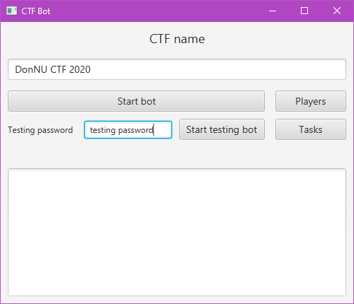
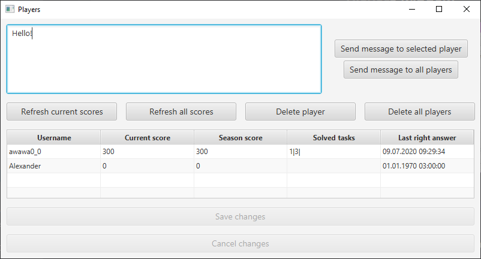
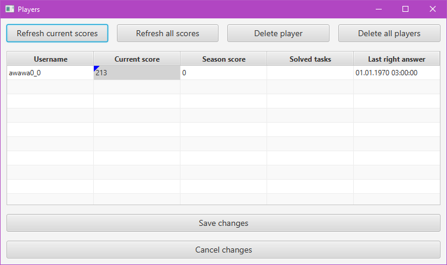
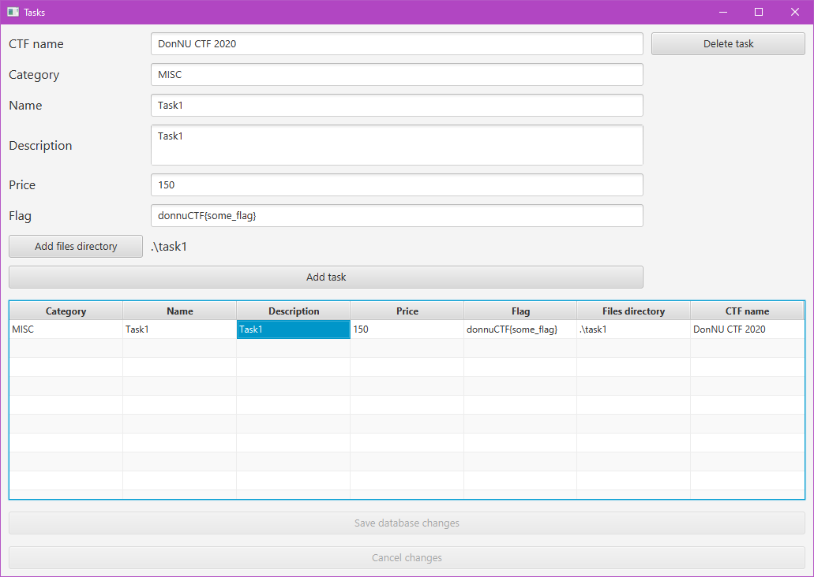

# CTF Bot

## Description
Telegram bot that is being used to organize CTF trainings in Donetsk National University.

## Usage
0) Download the bot .jar file [CTF_Bot.jar](out/artifacts/CTF_Bot_jar/CTF_Bot.jar) or build bot from sources.
1) Create folder "db" in the folder where bot is placed.
2) Put BotCredentials file to the folder where bot is placed filled as folows:
   
    token:|:<i>your_bot_token</i>\
    botName:|:<i>your_bot_name</i>
3) Run the CTF_Bot.jar. **Note that Java 8 is required. Although the program might run on more recent versions of JVM, using some features still can cause an error.**
    
## GUI

### Main window

Top text field is for CTF event name. The CTF name will be used by bot to look for tasks in database.

"Start bot" button will start Telegram bot.

"Start testing bot" button will start the bot with testing password from "Testing password" field. Players will get access to bot features only after they will send this password to the bot.

"Players" and "Tasks" buttons will open Players window and Tasks window respectively.

### Players window

"Refresh current scores" button sets "Current score" field for all users to 0. Other fields will remain untouched.

"Refresh all scores" button sets all fields for all users to default values (except of "Username" obviously).

"Delete player" button deletes currently selected user from database. Note that the program will not ask any confirmation for that and there are no way to restore data after that, so be careful with that.

"Delete all players" button completely cleans all data about players from database. And it will not ask confirmation as well as "Delete player" button.

"Save changes" button and "Cancel changes" button are used to save changed player info or cancel that changes. So when you change some values in the table you still need to press "Save changes" to actually change database. Changed but not committed changes are highlighted, you can see it on the screenshot below.

### Tasks window

"CTF name" is used to separate tasks for different CTF events. So if you want the tasks you add to be available in running Telegram bot, you have to set their CTF name equals to one you set on the Main window.

Other fields are speaking by themselves.

"Add files directory" button opens directory chooser that allow you to pick a directory in your filesystem where additional files for the tasks are laid out. Note that bot will send all files from that directory to players.

"Add task" button creates actually adds task to database according to filled fields.

Other buttons functionality is similar to Players window functionality